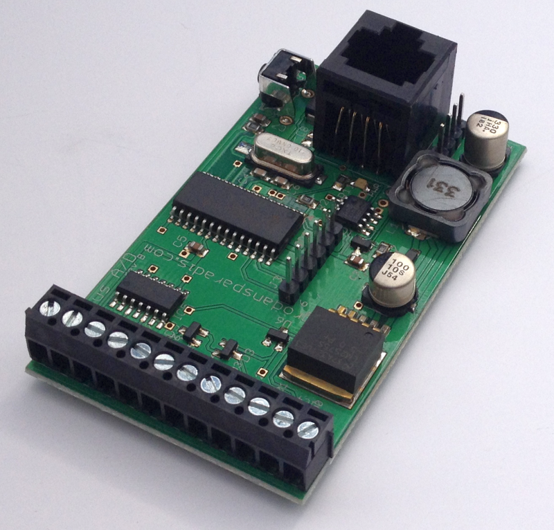

## Manual for the Vilnius module

**Document version:** ${/var/document-version} - ${/var/creation-time}
[HISTORY](./history.md)

The Vilnius A/D module is a CAN4VSCP based module with four 10-bit A/D channels for 0-5V or 0-10V and two 5V I/O channels that can be set as inputs or outputs. The module is designed for general use to read analog values and, like all other VSCP modules, can report readings automatically at user-specified intervals or when certain conditions are met.

The module comes with a GUID and is programmed with a bootloader and VSCP module functionality that works right out of the box.

* [Repository for the module](https://github.com/grodansparadis/can4vscp-vilnius)
* This manual is available [here](https://grodansparadis.github.io/can4vscp-vilnius/)
* Schematics reversion B [part 1](https://raw.githubusercontent.com/grodansparadis/can4vscp-vilnius/refs/heads/master/eagle/vilnius_sch1_rev_B.png), [part 2](https://raw.githubusercontent.com/grodansparadis/can4vscp-vilnius/refs/heads/master/eagle/vilnius_sch2_rev_B.png)
* Latest firmware for the module is available [here](https://github.com/grodansparadis/can4vscp-vilnius/tree/master/firmware)
* [MDF for the module](https://github.com/grodansparadis/can4vscp-vilnius/tree/master/mdf)

## VSCP

VSCP is a free and open automation protocol for IoT and m2m devices. Visit [the VSCP site](https://www.vscp.org) for more information.

**VSCP is free.** Placed in the **public domain**. Free to use. Free to change. Free to do whatever you want to do with it. VSCP is not owned by anyone. VSCP will stay free and gratis forever.

The specification for the VSCP protocol is [here](https://docs.vscp.org) 

VSCP documentation for various parts can be found [here](https://docs.vscp.org/).

If you use VSCP please consider contributing resources or time to the project ([https://github.com/sponsors/grodansparadis](https://github.com/sponsors/grodansparadis)).

## Buy a module

Ready made modules can be bought from [Grodans Paradis AB](https://www.grodansparadis.com).

## Document license

This document is licensed under [Creative Commons BY 4.0](https://creativecommons.org/licenses/by/4.0/) and can be freely copied, redistributed, remixed, transformed, built upon as long as you give credits to the author.

[filename](./bottom-copyright.md ':include')
