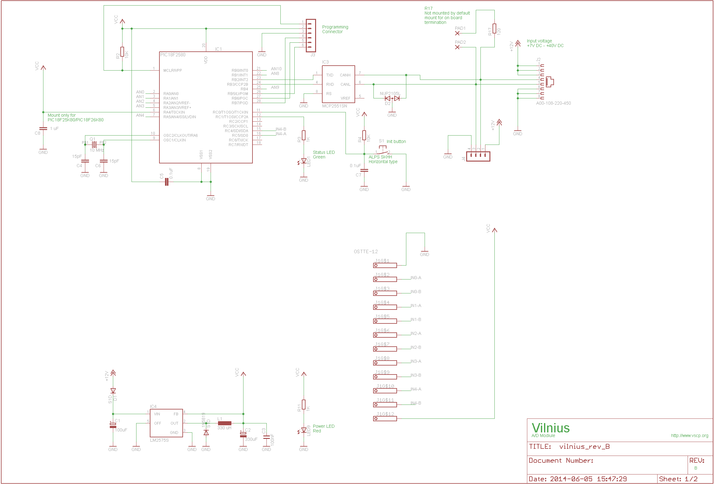
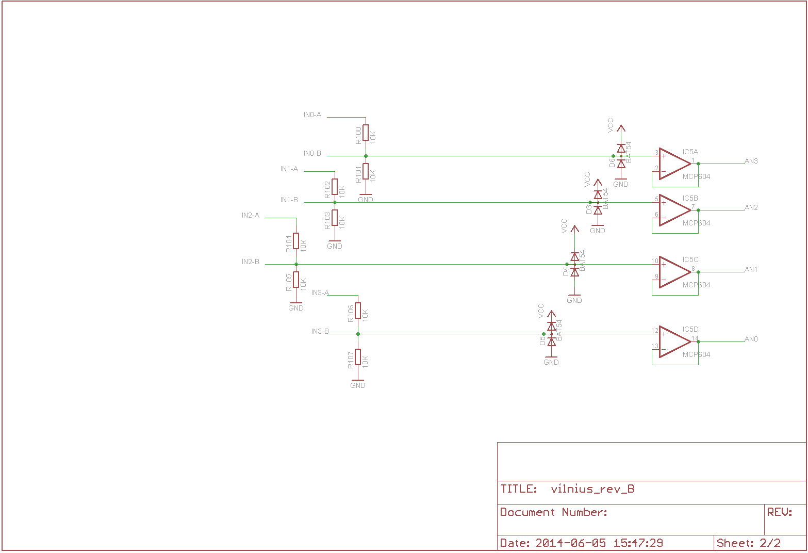
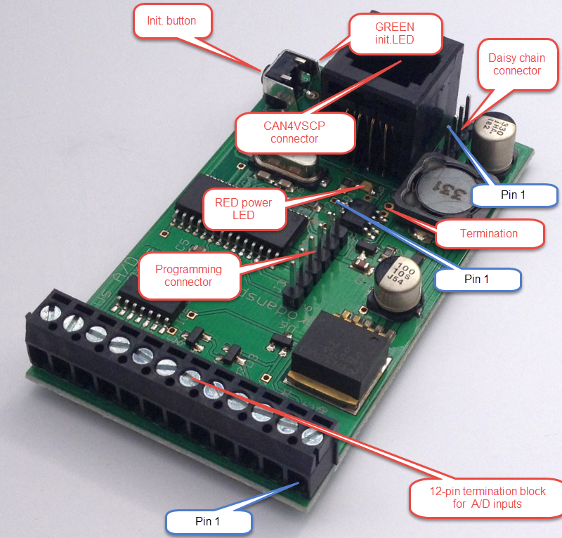
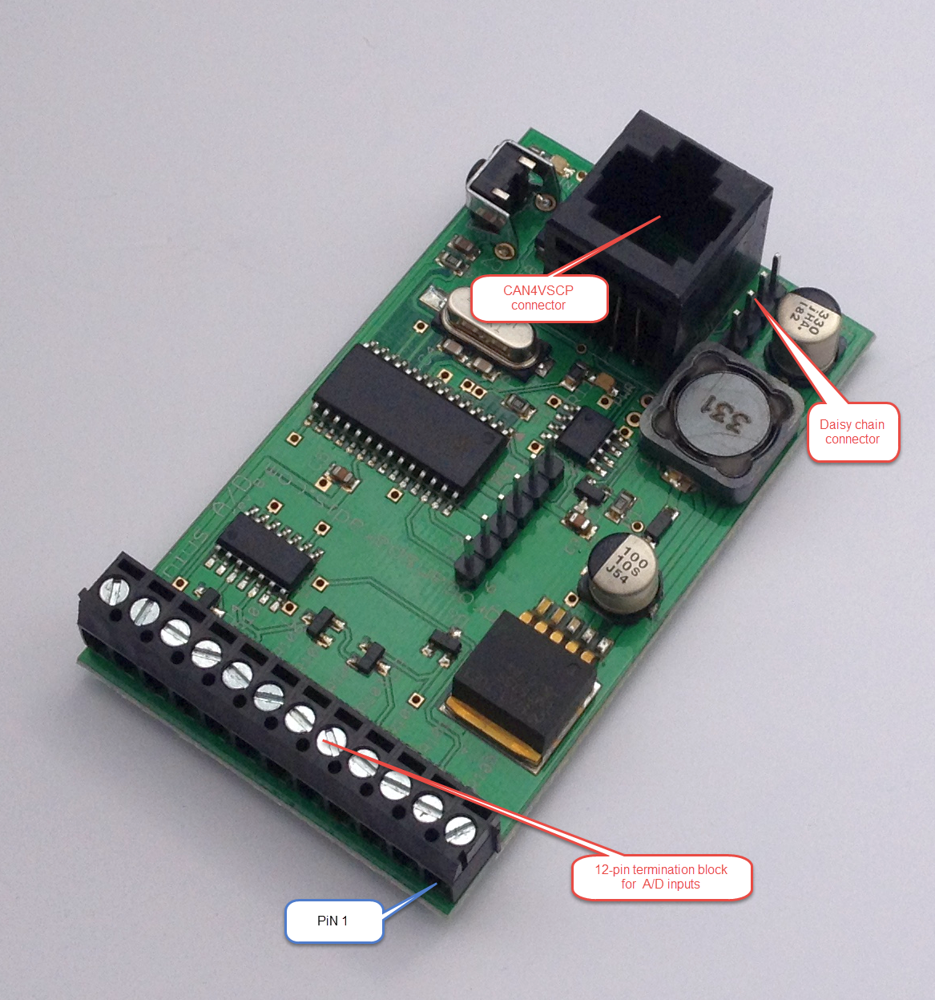
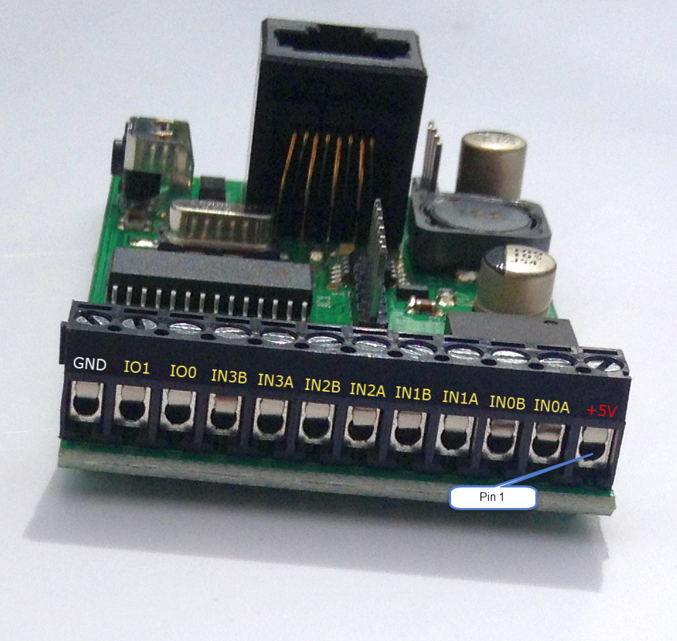
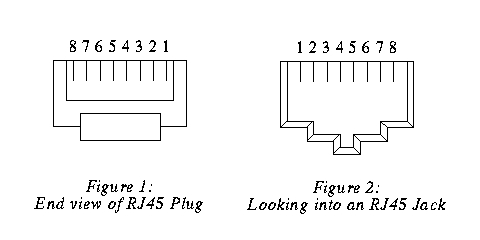
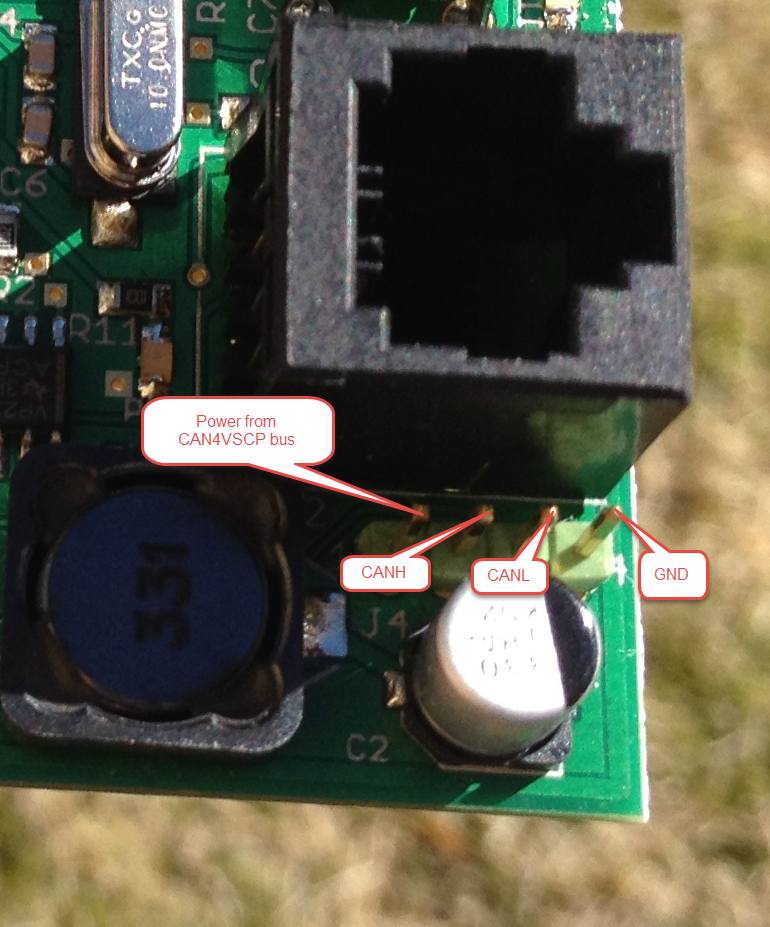
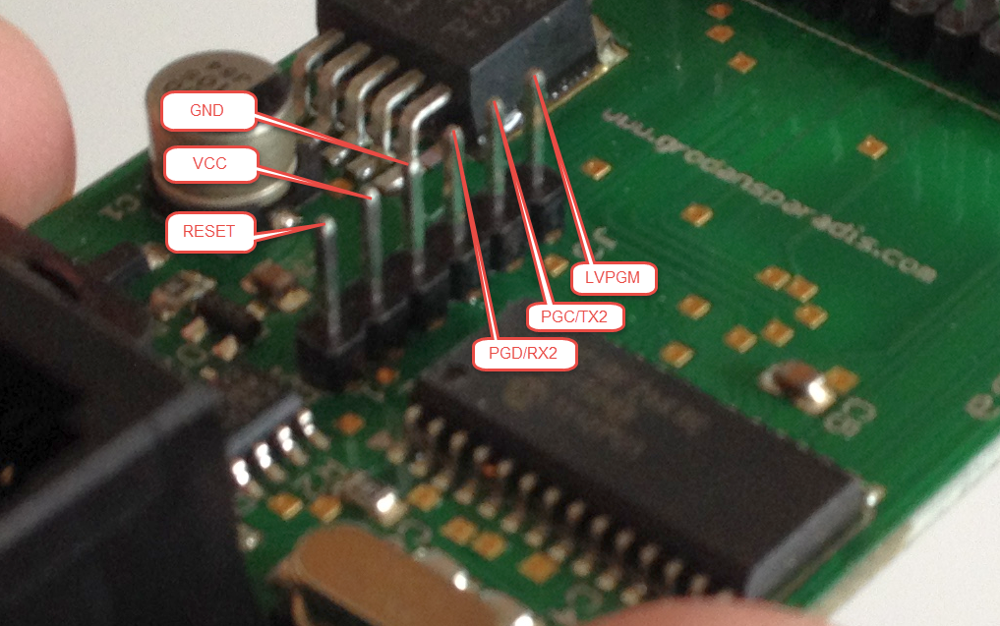

## Most current information

You can find the most current information about the Vilnius module at <http://www.grodansparadis.com/vilnius/vilnius.html>. On the site you can also find links to the latest firmware, drivers and schematics etc for its use.

## Installing the module

Connect the module to the CAN4VSCP bus. The red LED on the module should light up indicating that the device is powered. If this is the first time you start up the module the green lamp next to the initializing button will start to blink. This means that the module is trying to negotiate a nickname address with the rest of the modules on the bus. When it found a free nickname the green LED will light steady. If the green led does not start to blink press the initialization button until it does. 

It may take up to 30 seconds before the module have found a free nickname. If the green LED does not light steady after a minute you have to check that the bus is working and that there is a module on the bus.

Now your module is ready to use.

## The raw facts

  | Parameter                       | Value |
  | ------------------------------- |-------|
  | Current hardware reversion      | B                                                                         |
  | Current firmware version        | [See here](https://github.com/grodansparadis/can4vscp_vilnius/releases) |
  | Supply voltage                  | +9-+28 VDC |
  | PCB Size                        | 42mm x 72mm |
  | Power requirements              | 0.1W |
  | Communication                   | CAN4VSCP (CAN) 125 kbps |
  | Number of channels               | 4 |
  | Measurement range                | 0-5V and 0-10V |
  | A/D resolution                   | 10 bits |

## Schematics

Schematics: Rev B 

## Components

## Connectors

### Terminal block

 | Pin |  Description |
 |-----|--------------|
 | 1   | +5V (VCC)    |
 | 2   | IN0A        |
 | 3   | IN0B        |
 | 4   | IN1A        |
 | 5   | IN1B        |
 | 6   | IN2A        |
 | 7   | IN2B        |
 | 8   | IN3A        |
 | 9   | IN3B        |
 | 10  | I/O 1      |
 | 11  | I/O 0      |
 | 12  | Ground (GND) |

### RJ-XX pin-out

The unit is powered over the CAN4VSCP bus. The CAN4VSCP normally uses CAT5 or better twisted pair cable. You can use other cables if you which. The important thing is that the CANH and CANL signals uses a twisted cable. For connectors you can use RJ10, RJ11, RJ12 or the most common RJ45 connectors.

Recommended connector is RJ-34/RJ-12 or RJ-11 with pin out as in this table.

 | Pin |  Use         | RJ-11 | RJ-12 | RJ-45 | Patch Cable wire color T568B |
 |-----|--------------|-------|-------|-------|------------------------------|
 | 1   | +9-28V DC   |       |       | RJ-45 | Orange/White                 |
 | 2 1 | +9-28V DC |       | RJ-12 | RJ-45 |       Orange                       |
 | 3 2 1 | +9-28V DC | RJ-11 | RJ-12 | RJ-45 | Green/White                  |
 | 4 3 2 | CANH      | RJ-11 | RJ-12 | RJ-45 | Blue                         |
 | 5 4 3 | CANL      | RJ-11 | RJ-12 | RJ-45 | Blue/White                   |
 | 6 5 4 | GND       | RJ-11 | RJ-12 | RJ-45 | Green                        |
 | 7 6   | GND        |       | RJ-12 | RJ-45 | Brown/White                 |
 | 8     | GND          | |             | RJ-45 | Brown                       |

 

**RJ-11/12/45 pin-out**

**!** Always use a pair of twisted wires for CANH/CANL for best noise immunity. If the EIA/TIA 56B standard is used this condition will be satisfied. This is good as most Ethernet networks already is wired this way.

### Inter module connector

The inter module connector can be used to connect modules that are physically close to each other together in an easy way. Remember that the minimum length of a connection cable is 30 cm.

 | Pin |  Description |
 |-----|--------------|
 | 1   | Power from CAN4VSCP bus |
 | 2   | CANH        |
 | 3   | CANL        |
 | 4   | GND         |

### PIC programming Connector

 | Pin |  Description |
 |-----|--------------|
 | 1   | Reset        |
 | 2   | VCC          |
 | 3   | GND          |
 | 4   | PGD (RX of second serial port is here to) |
 | 5   | PGC (TX of second serial port is here to) |
 | 6   | LWPGM       |

\

### Functionality of the status LED

The LED is used to indicate the status of the module. It will light steady when the firmware is running and will blink when the module is in the nickname discovery process.

  | LED        | Description |
  |------------|-------------|
  | Steady     | No error. Firmware running. |
  | Blinking   | Module is going through the [nickname discovery process](http://www.vscp.org/docs/vscpspec/doku.php?id=vscp_level_i_specifics#address_or_nickname_assignment_for_level_i_nodes). |

### CAN

CAN4VSCP is a CAN based bus running at 125 kbps with the addition of DC power. If you are interested in how CAN works you have a pretty good intro [here](http://www.eeherald.com/section/design-guide/esmod9.html).

CAN is known to be robust and is there for used in vehicles and in the industry.

[filename](./bottom-copyright.md ':include')
